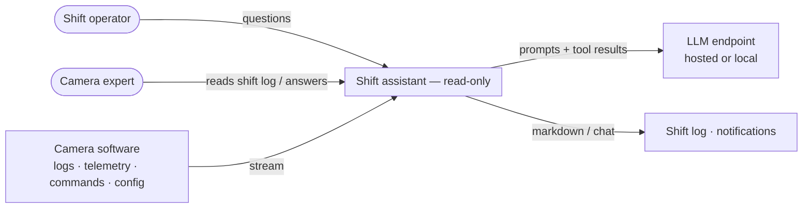
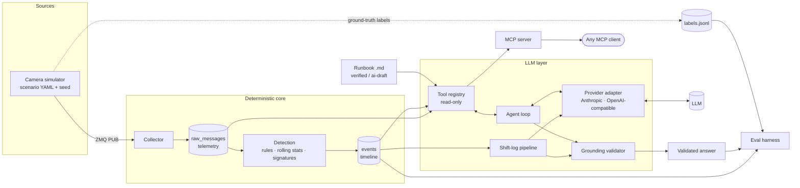
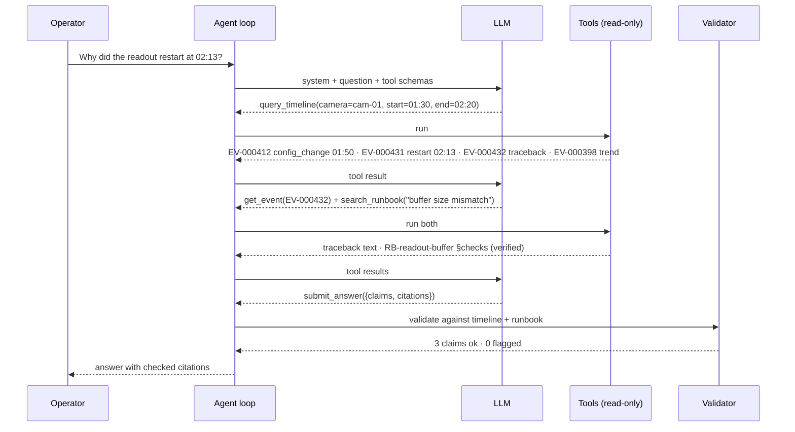

# 03 · Architecture

## 1. System context



The assistant **reads** from the camera and **writes** only its own outputs. No arrow points back into the camera. This is a structural property, not a prompt rule ([ADR-0001](adr/0001-read-only-by-construction.md)).

## 2. Containers and layers



| Layer | Component | Responsibility | Status |
|---|---|---|---|
| Sources | **Simulator** | Generates logs + telemetry for scripted scenarios, publishes on ZMQ, writes ground-truth labels | ✅ tier A synthetic; 🔨 real-format dialect ([ADR-0004](adr/0004-synthetic-simulator-as-ground-truth.md)) |
| Core | **Collector** | Subscribe, parse, store with source timestamp (UTC), camera, subsystem, level | ✅ v0 (raw text only) → 🔨 |
| Core | **Detection** | Limit rules, rate-of-change, heartbeat gaps, restarts, config changes, tracebacks, new signatures → events | 📐 ([ADR-0002](adr/0002-deterministic-detection-llm-for-language.md)) |
| Core | **Timeline** | SQLite tables for raw messages, telemetry and events | ✅ v0 (one table) → 🔨 |
| LLM | **Tool registry** | Defines each read-only tool once; generates MCP and agent schemas | 📐 ([ADR-0006](adr/0006-single-tool-registry-mcp.md)) |
| LLM | **Agent loop** | Model ↔ tools until a structured final answer or step limit | ✅ v0 → 🔨 |
| LLM | **Provider adapter** | One interface over Anthropic and OpenAI-compatible (Ollama, vLLM) APIs | 📐 ([ADR-0007](adr/0007-model-agnostic-provider-interface.md)) |
| LLM | **Validator** | Checks citations and values; flags or drops claims | 📐 ([ADR-0005](adr/0005-grounding-validator.md)) |
| LLM | **Shift-log pipeline** | Fixed steps: pull timeline → group → LLM writes text → validate | 📐 ([ADR-0003](adr/0003-pipelines-first-one-agent-loop.md)) |
| Output | **MCP server** | Same tools for Claude Desktop / Claude Code / any MCP client | ✅ v0 |
| Eval | **Harness** | Runs question sets per config; scores automatically; writes report | ✅ v0 (manual scoring) → 📐 |

**Failure isolation:** collector and detection run without the LLM layer. If the model endpoint is down, events and the rule-based part of the shift log still exist (NFR-02).

## 3. Data model (SQLite)

```sql
-- what the collector stores
CREATE TABLE raw_messages (
  msg_id     INTEGER PRIMARY KEY,
  ts         TEXT NOT NULL,     -- source timestamp, ISO-8601 UTC
  ts_ingest  TEXT NOT NULL,
  camera     TEXT NOT NULL,     -- 'cam-01'
  subsystem  TEXT NOT NULL,     -- 'readout', 'cooling', 'hv', 'daq', 'config', 'os'
  level      TEXT NOT NULL,     -- DEBUG | INFO | WARNING | ERROR | CRITICAL
  text       TEXT NOT NULL      -- multi-line tracebacks joined into one record
);

CREATE TABLE telemetry (
  ts TEXT NOT NULL, camera TEXT NOT NULL, channel TEXT NOT NULL, value REAL NOT NULL
);

-- what detection produces; the LLM reasons over this
CREATE TABLE events (
  event_id   TEXT PRIMARY KEY,  -- 'EV-000412', stable within a snapshot
  ts         TEXT NOT NULL,
  camera     TEXT NOT NULL,
  subsystem  TEXT NOT NULL,
  kind       TEXT NOT NULL,     -- limit | trend | gap | restart | config_change | traceback | new_signature
  severity   TEXT NOT NULL,     -- info | warning | alarm
  rule_id    TEXT NOT NULL,     -- which rule fired, e.g. 'R-COOL-ROC-01'
  summary    TEXT NOT NULL,     -- one line, generated by code, not by the LLM
  evidence   TEXT NOT NULL      -- JSON: msg_ids, feature values, thresholds
);
```

Why SQLite: one file, zero setup, WAL mode lets tools read while the collector writes, and a copy of the file is a frozen snapshot for evaluation. DuckDB is the upgrade path for large telemetry volumes.

## 4. Tool contract

All tools are read-only, bounded in output size, and return JSON with a `truncated` flag when they hit a cap. Time windows are relative to the newest record in the snapshot, so answers are reproducible.

| Tool | Input | Returns | Why this shape |
|---|---|---|---|
| `query_timeline` | `camera?`, `subsystem?`, `kind?`, `min_severity?`, `since_minutes` or `start`/`end`, `limit` | list of events (id, ts, kind, severity, summary) | Most questions start here. Summaries are short, so it costs few tokens |
| `get_event` | `event_id` | full event incl. evidence, raw lines, traceback | Drill-down on demand instead of dumping everything up front |
| `get_telemetry_features` | `camera`, `channel`, window | n, mean, min, max, slope per hour, z-score vs. baseline, gaps | Principle 3: features, not raw series |
| `search_runbook` | `query`, `limit` | sections with `section_id`, `status` (verified / ai-draft), text | Knowledge in files, status visible to the model and the validator |
| `submit_answer` | structured final answer (below) | — | Ends the loop; makes output machine-checkable |

The v0 raw-text tools (`list_topics`, `get_recent_messages`, `count_keywords`) stay available in the **baseline** configuration for experiment E1.

### Final answer schema

```json
{
  "status": "answered | insufficient_data | out_of_scope",
  "answer": "Readout restarted at 02:13 after a config reload at 01:50 ...",
  "claims": [
    {
      "text": "The restart followed a configuration reload at 01:50.",
      "citations": ["EV-000412", "EV-000431"],
      "values": {}
    },
    {
      "text": "Cooling plate temperature is rising at 0.8 °C/h.",
      "citations": ["EV-000398"],
      "values": {"slope_c_per_h": 0.8}
    }
  ]
}
```

## 5. Investigation flow (UC-01)



## 6. Shift-log pipeline (UC-05)

Fixed steps. The LLM fills in one step only.

1. `query_timeline(whole shift)` (code)
2. group events into incidents by camera, subsystem and time proximity (code)
3. write each incident paragraph and the summary (LLM, given only that incident's events)
4. validate citations (code)
5. render markdown with a table of events (code)

If step 3 fails, the log still renders from steps 1, 2, 4 and 5 with code-written summaries.

## 7. Repository layout (target)

```
telemetry-agent/
├── pyproject.toml           # uv-managed, Python 3.12
├── Makefile                 # make demo | test | eval | report
├── src/shiftassist/
│   ├── sim/                 # simulator, scenario loader, fault injectors, label writer
│   ├── collect/             # ZMQ subscriber, parser, traceback assembler
│   ├── detect/              # rules, rolling stats, signature miner
│   ├── store/               # schema, read-only connection, queries
│   ├── tools/               # registry + tool implementations
│   ├── agent/               # loop, providers/, validator, prompts
│   ├── pipelines/           # shift log
│   └── mcp_server.py
├── scenarios/               # S01-nominal.yaml, S03-readout-after-config.yaml, ...
├── runbook/                 # one .md per signature, front-matter status
├── eval/                    # questions (generated + hand-written), scorers, runner, reports/
├── baseline/                # v0 spike, kept for experiment E1
├── tests/
└── docs/
```

## 8. Deployment views

| Stage | Where the model runs | Data |
|---|---|---|
| Demo (this repo) | Hosted API or local Ollama on a laptop | Synthetic only |
| Lab | Local model on a workstation | Lab logs; nothing leaves the network |
| Production site | On-site GPU server, no internet dependency | Everything stays on site |
